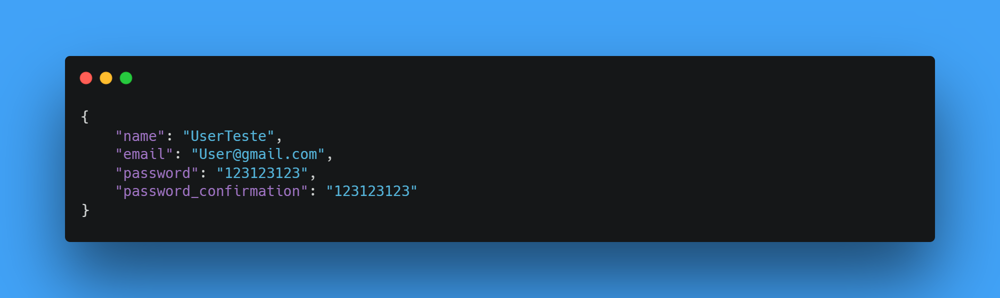
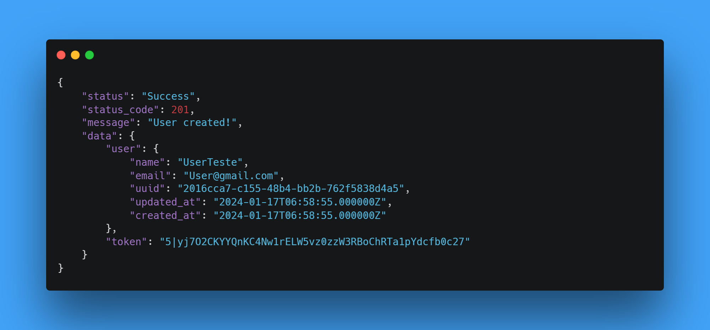
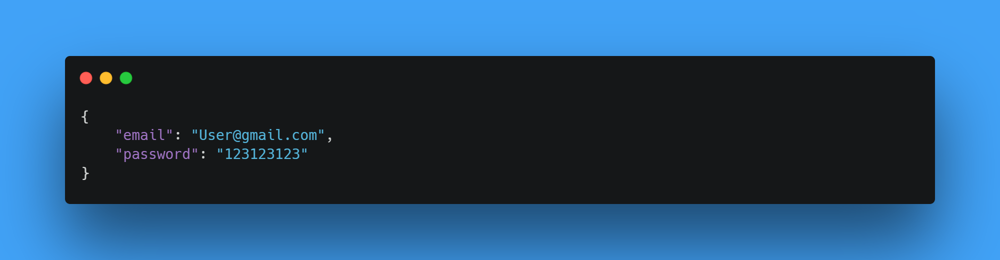
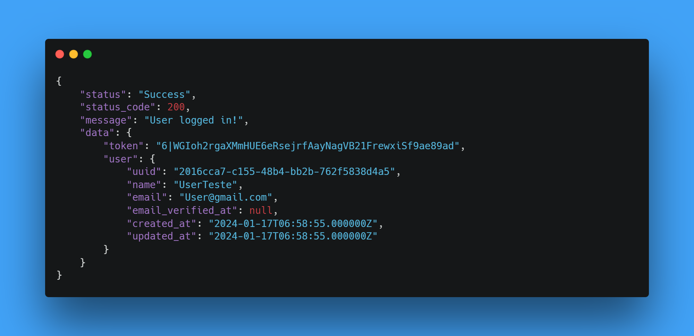

# Api Ezoom - Desafio Técnico - Dev PHP Pleno

### Principais Recursos

-   **Listagem de Tarefas:** Recupere uma lista de tarefas com base em vários critérios, como usuário, status, prioridade e prazo.
-   **Filtragem Avançada:** Utilize filtros detalhados para refinar os resultados e encontrar informações específicas.
-   **Criação e Atualização de Tarefas:** Adicione novas tarefas e atualize informações existentes conforme necessário.
-   **Exclusão de Tarefas:** Remova tarefas da base de dados conforme necessário.

---

# Pages

### Home page


### Tasks List


<br/>

## Índice

### [Tecnologias](#destaque-das-tecnologias-utilizadas)

### [Conceitos / Patterns](#destaque-dos-conceitos-e-patterns-utilizados)

### [Pré-requisitos](#pré-requisitos)

### [Rodando localmente](#rodando-localmente)

### [Postman](#postman-preview)

-   [Documentação completa Postman](/wiki/postman.md)

### [Documentação da API](#api-auth)

-   [Api Auth](#api-auth)

    -   [Documentação completa Auth](/wiki/api_auth.md)

-   [Tasks](#tasks)

    -   [Documentação completa Tasks](/wiki/tasks.md)

---

<br/>
<br/>

## Destaque das tecnologias utilizadas

| Tecnologias       | versão  | Descrição                                                                                                                                                                |
| :---------------- | :------ | :----------------------------------------------------------------------------------------------------------------------------------------------------------------------- |
| `PHP`             | `8.1`   | Uma linguagem de script de uso geral popular                                                                                                                             |
| `Laravel`         | `10.10` | O Framework PHP para Artesãos da Web                                                                                                                                     |
| `MySQL`           | `15.x`  | O MySQL é um sistema de gerenciamento de banco de dados, que utiliza a linguagem SQL como interface.                                                                     |
| `Laravel Debuger` | `7.2`   | Monitoramento de erros e desempenho do Laravel                                                                                                                           |
| `Guzzlehttp`      | `7.4`   | Guzzle é um cliente PHP HTTP que facilita o envio de solicitações HTTP.                                                                                                  |
| `Sanctum`         | `3.3`   | Laravel Sanctum Fornece um sistema de autenticação leve para SPAs (aplicativos de página única), aplicativos móveis e APIs simples baseadas em token.                    |
| `Vite`            | `5.0`   | Vite é uma ferramenta de construção que foi inicialmente desenvolvida para Vue.js.                                                                                       |
| `Postman`         | `10.x`  | Postman é uma plataforma de API para desenvolvedores projetar, construir, testar e iterar suas APIs.                                                                     |
| `Dbeaver`         | `23.x`  | DBeaver é um aplicativo de software cliente SQL e uma ferramenta de administração de banco de dados.                                                                     |
| `Pest`            | `2.x`   | Pest is a testing framework with a focus on simplicity, meticulously designed to bring back the joy of testing in PHP.                                                   |
| `Migration`       | `---`   | As migrações são como controle de versão para seu banco de dados, permitindo que sua equipe defina e compartilhe a definição do esquema de banco de dados do aplicativo. |
| `PSR-4`           | `---`   | A PSR-4 é uma recomendação da comunidade PHP para organização e carregamento de arquivos e classes PHP.                                                                  |

<br>
<br>

## Destaque dos conceitos e patterns utilizados

| Conceitos/Patterns          | Descrição                                                                                                                                                                                         |
| :-------------------------- | :------------------------------------------------------------------------------------------------------------------------------------------------------------------------------------------------ |
| `MVC`                       | MVC é o acrônimo de Model-View-Controller é um padrão de projeto de software, ou padrão de arquitetura de software.                                                                               |
| `POO`                       | Programação orientada a objetos é um paradigma de programação baseado no conceito de "objetos".                                                                                                   |
| `PHP SOLID`                 | SOLID é um acrônimo para os primeiros cinco princípios de design orientado a objetos (OOD).                                                                                                       |
| `API RESTful `              | Api Rest é uma interface de programação de aplicações (API ou API web) que está em conformidade com as restrições do estilo de arquitetura REST, permitindo a interação com serviços web RESTful. |
| `Gitflow`                   | Gitflow é um fluxo de trabalho Git legado que originalmente era uma estratégia inovadora e disruptiva para gerenciar ramificações do Git.                                                         |
| `Builder pattern`           | Builder é um padrão de projeto de software criacional que permite a separação da construção de um objeto complexo da sua representação.                                                           |
| `Factory pattern`           | Use uma função de fábrica para criar objetos.                                                                                                                                                     |
| `Provider pattern`          | Disponibilize dados para vários componentes filhos.                                                                                                                                               |
| `Banco de dados relacional` | Um banco de dados relacional é um banco de dados que modela os dados de uma forma que eles sejam percebidos pelo usuário como tabelas, ou mais formalmente relações.                              |

<br>

## Pré-requisitos

-   PHP ^8.1
-   MySql ^15
-   Laravel 10.x
-   Servidor Linux

<br>

---

<br>
<br>

## Rodando localmente

### Clone o projeto

```bash
  git clone https://github.com/DaniloWA/ezoomdot.git
```

### Entre no diretório do projeto

```bash
  cd ezoomdot/
```

### Copiar ficheiro environment

```bash
  cp .env.example .env
```

### Instale as dependências

```bash
  composer install
  npm install
```

### Gerar key de criptografia

> Essa chave é usada pelo serviço de criptografia Illuminate e deve ser definida como uma cadeia aleatória de 32 caracteres, caso contrário, essas cadeias criptografadas não serão seguras. Faça isso antes de implantar um aplicativo!

```bash
  php artisan key:generate
```

### Definir configuração da conexão da base de dados

#### Substitui essas linhas no ficheiro ./.env

> Está por default minha database na AWS. Não obrigatorio utilizar! Valida até : 01/04/2024.

```bash
DB_CONNECTION=mysql
DB_HOST=dev-ezoom-db.c7qg0s88cg7u.us-east-1.rds.amazonaws.com
DB_PORT=3306
DB_DATABASE=dev-ezoom-db
DB_USERNAME=admin
DB_PASSWORD=admin123
```

> Caso o nome da base de dados seja diferente altere essa linha : DB_DATABASE= \< NOME_AQUI \>

### Criando base de dados

```bash
  php artisan migrate
```

### (Opcional/Recomendado) Povoando base de dados com dados

```bash
  php artisan db:seed
```

### (Opcional) Ou pode rodar os ultimos dois passos em conjuto

```bash
  php artisan migrate --seed
```

### (Opcional) Rodar Tests

```bash
  ./vendor/bin/pest
```

<br>

[Início](#principais-recursos)

---

<br>
<br>

# Postman preview

### Importar suite de endpoints para o [Postman](/postman) (ficheiros)

```bash
  cd ./postman
```

<br>

> **Observação**: Estes gifs servem apenas como um guia visual, utilize-o em conjunto com os arquivos fornecidos para uma configuração eficiente..

### Passo a Passo para importação do ficheiro do endpoint pelo GUI


<br>

### Passo a Passo para importação do ficheiro do environment pelo GUI


#### (Opcional) Para visualizar os dados dos endpoints

```bash
  cat .\postman\api_ezoom_dev.postman_collection.json
```

#### (Opcional) Para visualizar os dados do ambiente local do environment

```bash
  cat .\postman\api_ezoom_dev.postman_environment.json
```

<br>

[Início](#principais-recursos)

---

<br>

# Documentação da API

# [Api Auth](/wiki/api_auth.md)

<br>

## POST /register

```
  http://[SUA_URI]/api/v1/auth/register
```

<br>

#### BODY



<details> 
  <summary>Code</summary>

```json
{
    "name": "UserTeste",
    "email": "User@gmail.com",
    "password": "123123123",
    "password_confirmation": "123123123"
}
```

</details>

<br>

#### Response 200



<details> 
  <summary>Code</summary>

```json
{
    "status": "Success",
    "status_code": 201,
    "message": "User created!",
    "data": {
        "user": {
            "name": "UserTeste",
            "email": "User@gmail.com",
            "uuid": "2016cca7-c155-48b4-bb2b-762f5838d4a5",
            "updated_at": "2024-01-17T06:58:55.000000Z",
            "created_at": "2024-01-17T06:58:55.000000Z"
        },
        "token": "5|yj7O2CKYYQnKC4Nw1rELW5vz0zzW3RBoChRTa1pYdcfb0c27"
    }
}
```

</details>

<br>

## POST /login

```
  http://[SUA_URI]/api/v1/auth/login
```

<br>

#### BODY



<details> 
  <summary>Code</summary>

```json
{
    "email": "User@gmail.com",
    "password": "123123123"
}
```

</details>

<br>

#### Response 200



<details> 
  <summary>Code</summary>

```json
{
    "status": "Success",
    "status_code": 200,
    "message": "User logged in!",
    "data": {
        "token": "6|WGIoh2rgaXMmHUE6eRsejrfAayNagVB21FrewxiSf9ae89ad",
        "user": {
            "uuid": "2016cca7-c155-48b4-bb2b-762f5838d4a5",
            "name": "UserTeste",
            "email": "User@gmail.com",
            "email_verified_at": null,
            "created_at": "2024-01-17T06:58:55.000000Z",
            "updated_at": "2024-01-17T06:58:55.000000Z"
        }
    }
}
```

</details>

<br>

[Início](#principais-recursos)

---

## License

MIT

**Free Software, Hell Yeah!**
